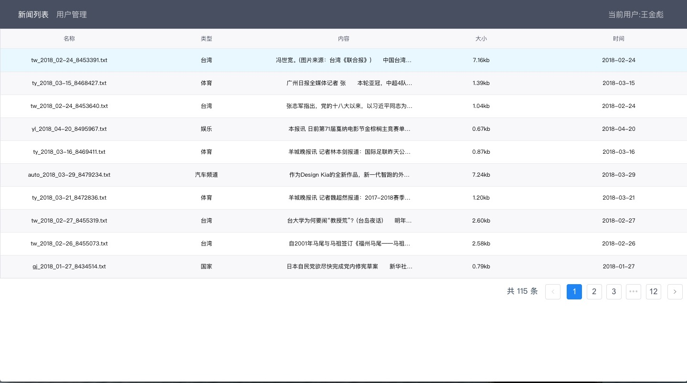
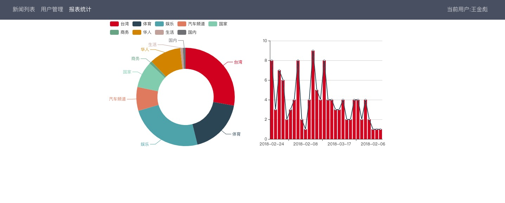

# shownews
# 项目背景：
- 把search_news获取到的新闻信息存到Mysql中
	- 后期迁徙MongoDB
- 新闻信息的可视化(前端展示/更新)
- 利用Tornado来做以上两者的桥梁

# 后端实现
## 1.项目依赖:
- Python2.7
- Mysql
	- Mysql database news需要提前建立好
	- table newsInfo
- Tornado
- json
	- 格式化JSON数据
- binascii
	- 对获取到的txt内容编码存储

# 前端实现
## 1.项目依赖:
- Vue 2.5.2
- Webpack 3.6.0
- Axios 0.18.0
- 项目具体内容请看news文件目录

# 具体功能
- 新闻存储到数据库
	- 数据库名称: news 
	- 数据表:
		- newsInfo 所有的新闻信息(id name type text size time)
		- user 用户信息(phonenum name password)
- 注册 登录功能
- 获取所有新闻
- 更新/更改新闻信息
- 计划新增内容
	- 1.各类新闻占比饼状图(已经完成)
	- 2.增加搜索条件
	- 3. 接口说明文档
	- 4. 新想法  按日期来统计柱状图📊 每天的新闻量  点击壮壮图进行联动饼状图(分类占比)

# 有待优化项
- 界面优化
- 登录注册的用户密码加密
- 文档的整理
- 数据库的迁徙

# 项目展示

# 遇到的问题
- 1.Mysql

		$mysql -u root -p
		Enter password: 
		ERROR 2002 (HY000): Can't connect to local MySQL server through socket '/tmp/mysql.sock' (2)
	- 解决方法

			mysqld stop
			mysql.server start
	[参考链接](https://stackoverflow.com/questions/11105796/error-2002-cant-connect-to-local-mysql-server-through-socket-applications-ma)  

.
|-- README.md
|-- chart.png
|-- login.png
|-- main.png
|-- news
|   |-- README.md
|   |-- build
|   |   |-- build.js
|   |   |-- check-versions.js
|   |   |-- logo.png
|   |   |-- utils.js
|   |   |-- vue-loader.conf.js
|   |   |-- webpack.base.conf.js
|   |   |-- webpack.dev.conf.js
|   |   |-- webpack.prod.conf.js
|   |   `-- webpack.test.conf.js
|   |-- config
|   |   |-- dev.env.js
|   |   |-- index.js
|   |   |-- prod.env.js
|   |   `-- test.env.js
|   |-- dist
|   |   |-- index.html
|   |   `-- static
|   |-- index.html
|   |-- package-lock.json
|   |-- package.json
|   |-- src
|   |   |-- App.vue
|   |   |-- assets
|   |   |-- components
|   |   |-- config
|   |   |-- main.js
|   |   |-- route.js
|   |   |-- router
|   |   `-- static
|   |-- static
|   `-- test
|       |-- e2e
|       `-- unit
|-- server
|   |-- README.md
|   |-- regester.py
|   |-- txt
|   |   |-- auto_2018_03-14_8467300.txt
|   |   |-- auto_2018_03-20_8471789.txt
|   |   |-- auto_2018_03-21_8472421.txt
|   |   |-- auto_2018_03-22_8473418.txt
|   |   |-- auto_2018_03-27_8477068.txt
|   |   |-- auto_2018_03-28_8478061.txt
|   |   |-- auto_2018_03-28_8478092.txt
|   |   |-- auto_2018_03-29_8479202.txt
|   |   |-- auto_2018_03-29_8479234.txt
|   |   |-- business_2018_02-08_8444119.txt
|   |   |-- gj_2018_01-26_8433599.txt
|   |   |-- gj_2018_01-26_8433605.txt
|   |   |-- gj_2018_01-26_8433792.txt
|   |   |-- gj_2018_01-26_8433797.txt
|   |   |-- gj_2018_01-26_8434036.txt
|   |   |-- gj_2018_01-26_8434056.txt
|   |   |-- gj_2018_01-26_8434423.txt
|   |   |-- gj_2018_01-26_8434441.txt
|   |   |-- gj_2018_01-27_8434514.txt
|   |   |-- gj_2018_01-27_8434522.txt
|   |   |-- gn_2018_03-11_8464811.txt
|   |   |-- hr_2018_04-02_8481732.txt
|   |   |-- hr_2018_04-02_8481735.txt
|   |   |-- hr_2018_04-02_8481982.txt
|   |   |-- hr_2018_04-03_8482121.txt
|   |   |-- hr_2018_04-03_8482248.txt
|   |   |-- hr_2018_04-03_8482256.txt
|   |   |-- hr_2018_04-03_8482316.txt
|   |   |-- hr_2018_04-03_8482322.txt
|   |   |-- hr_2018_04-03_8482346.txt
|   |   |-- hr_2018_04-03_8482347.txt
|   |   |-- hr_2018_04-03_8482392.txt
|   |   |-- hr_2018_04-03_8482400.txt
|   |   |-- sh_2018_02-06_8442753.txt
|   |   |-- tw_2018_02-23_8452837.txt
|   |   |-- tw_2018_02-23_8452854.txt
|   |   |-- tw_2018_02-23_8452996.txt
|   |   |-- tw_2018_02-23_8453064.txt
|   |   |-- tw_2018_02-24_8453281.txt
|   |   |-- tw_2018_02-24_8453381.txt
|   |   |-- tw_2018_02-24_8453383.txt
|   |   |-- tw_2018_02-24_8453391.txt
|   |   |-- tw_2018_02-24_8453623.txt
|   |   |-- tw_2018_02-24_8453640.txt
|   |   |-- tw_2018_02-24_8453672.txt
|   |   |-- tw_2018_02-24_8453724.txt
|   |   |-- tw_2018_02-25_8454108.txt
|   |   |-- tw_2018_02-25_8454174.txt
|   |   |-- tw_2018_02-25_8454231.txt
|   |   |-- tw_2018_02-25_8454267.txt
|   |   |-- tw_2018_02-26_8454732.txt
|   |   |-- tw_2018_02-26_8454745.txt
|   |   |-- tw_2018_02-26_8454766.txt
|   |   |-- tw_2018_02-26_8454790.txt
|   |   |-- tw_2018_02-26_8454970.txt
|   |   |-- tw_2018_02-26_8454974.txt
|   |   |-- tw_2018_02-26_8455016.txt
|   |   |-- tw_2018_02-26_8455073.txt
|   |   |-- tw_2018_02-27_8455285.txt
|   |   |-- tw_2018_02-27_8455294.txt
|   |   |-- tw_2018_02-27_8455316.txt
|   |   |-- tw_2018_02-27_8455319.txt
|   |   |-- tw_2018_02-28_8455993.txt
|   |   |-- tw_2018_02-28_8456051.txt
|   |   |-- tw_2018_02-28_8456053.txt
|   |   |-- tw_2018_02-28_8456153.txt
|   |   |-- ty_2018_03-15_8468170.txt
|   |   |-- ty_2018_03-15_8468427.txt
|   |   |-- ty_2018_03-15_8468430.txt
|   |   |-- ty_2018_03-16_8468981.txt
|   |   |-- ty_2018_03-16_8468983.txt
|   |   |-- ty_2018_03-16_8469006.txt
|   |   |-- ty_2018_03-16_8469183.txt
|   |   |-- ty_2018_03-16_8469407.txt
|   |   |-- ty_2018_03-16_8469411.txt
|   |   |-- ty_2018_03-17_8470102.txt
|   |   |-- ty_2018_03-17_8470117.txt
|   |   |-- ty_2018_03-17_8470121.txt
|   |   |-- ty_2018_03-20_8471838.txt
|   |   |-- ty_2018_03-20_8472037.txt
|   |   |-- ty_2018_03-20_8472300.txt
|   |   |-- ty_2018_03-21_8472836.txt
|   |   |-- ty_2018_03-21_8472838.txt
|   |   |-- ty_2018_03-22_8473165.txt
|   |   |-- ty_2018_03-27_8477031.txt
|   |   |-- ty_2018_03-27_8477041.txt
|   |   |-- ty_2018_03-27_8477045.txt
|   |   |-- yl_2018_04-19_8495056.txt
|   |   |-- yl_2018_04-19_8495138.txt
|   |   |-- yl_2018_04-19_8495330.txt
|   |   |-- yl_2018_04-19_8495421.txt
|   |   |-- yl_2018_04-19_8495637.txt
|   |   |-- yl_2018_04-20_8495659.txt
|   |   |-- yl_2018_04-20_8495916.txt
|   |   |-- yl_2018_04-20_8495967.txt
|   |   |-- yl_2018_04-20_8496066.txt
|   |   |-- yl_2018_04-20_8496075.txt
|   |   |-- yl_2018_04-20_8496095.txt
|   |   |-- yl_2018_04-20_8496099.txt
|   |   |-- yl_2018_04-21_8496720.txt
|   |   |-- yl_2018_04-21_8496721.txt
|   |   |-- yl_2018_04-22_8497009.txt
|   |   |-- yl_2018_04-22_8497029.txt
|   |   |-- yl_2018_04-23_8497812.txt
|   |   |-- yl_2018_04-23_8497934.txt
|   |   |-- yl_2018_04-23_8497964.txt
|   |   |-- yl_2018_04-23_8497977.txt
|   |   |-- yl_2018_04-24_8498779.txt
|   |   |-- yl_2018_04-24_8498853.txt
|   |   |-- yl_2018_04-24_8498854.txt
|   |   |-- yl_2018_04-24_8498878.txt
|   |   |-- yl_2018_04-25_8499691.txt
|   |   |-- yl_2018_04-25_8499722.txt
|   |   |-- yl_2018_04-25_8499724.txt
|   |   `-- yl_2018_04-25_8499747.txt
|   |-- webserver.py
|   `-- writedb.py
`-- web
    |-- html
    |   `-- index.html
    `-- js
        `-- jquery.js

20 directories, 146 files
